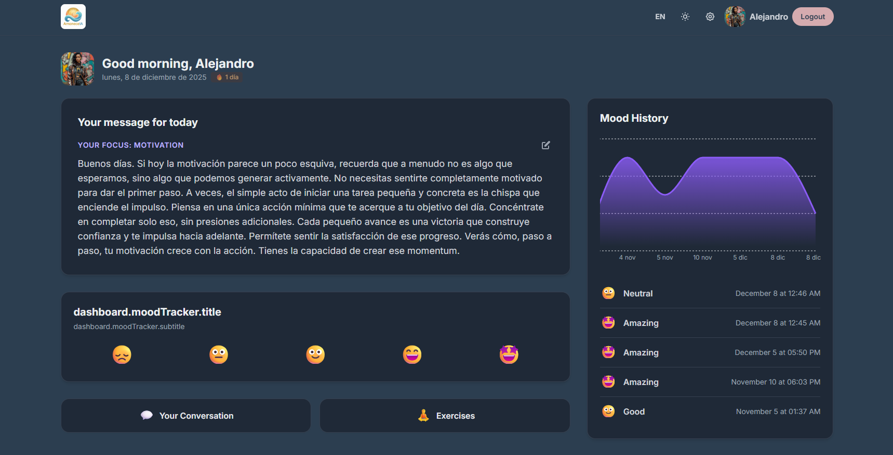

<div align="center">
  
  
  # 🌅 AmanecerIA
  
  **Tu compañero emocional impulsado por Inteligencia Artificial.**
  
  [](https://reactjs.org/)
  [](https://vitejs.dev/)
  [](https://tailwindcss.com/)
  [](https://supabase.com/)
  [](https://deepmind.google/technologies/gemini/)

</div>

---

## 🚀 Sobre el Proyecto

**AmanecerIA** es una aplicación web progresiva (PWA) diseñada para ser tu diario emocional inteligente. Más que un simple tracker de estado de ánimo, AmanecerIA utiliza la potencia de **Google Gemini** para ofrecerte apoyo emocional personalizado, consejos prácticos y una escucha activa en tiempo real.

Este **MVP (Producto Mínimo Viable)** demuestra cómo la tecnología puede integrarse con el bienestar mental para crear hábitos positivos y fomentar la autoconciencia.

## ✨ Características Principales

### 🎯 Núcleo (Core)

- **Rastreador de Ánimo (Mood Tracker):** Registra cómo te sientes diariamente con una interfaz intuitiva basada en emojis.
- **Apoyo IA Personalizado:** Recibe mensajes de apoyo instantáneos y adaptados a tu estado de ánimo actual y tu foco del día (Trabajo, Relaciones, Personal, etc.).
- **Chat Persistente:** Conversa con tu asistente emocional. El historial se guarda para dar continuidad a tus sesiones.
- **Personalización:** Ajusta el tono (Empático, Directo, Ingenioso) y la longitud de las respuestas de la IA.

### 🏆 Gamificación y Premium

- **Rachas (Streaks):** Mantén la motivación viendo cuántos días seguidos has cuidado de tu bienestar emocional. 🔥
- **Gráficos de Tendencias:** Visualiza tu evolución emocional a lo largo del tiempo con gráficos interactivos (Feature Premium).
- **Biblioteca de Ejercicios:** Accede a ejercicios guiados de Mindfulness, Respiración y TCC (Terapia Cognitivo-Conductual) para gestionar el estrés y la ansiedad.

## 🛠️ Stack Tecnológico

- **Frontend:** React + TypeScript + Vite
- **Estilos:** TailwindCSS (Diseño Responsive y Dark Mode)
- **Base de Datos & Auth:** Supabase
- **IA:** Google Gemini API (`@google/genai`)
- **Visualización:** Recharts
- **Visualización:** Recharts
- **Despliegue:** Vercel / Netlify (Ready)

## 🏗️ Mejoras Técnicas Recent (Refactorización)

El proyecto ha pasado por una auditoría de arquitectura "Senior" para asegurar escalabilidad y mantenibilidad:

- **Clean Architecture:** Implementación de **Repository Pattern** (`authRepository`, `profileRepository`, `moodRepository`) para desacoplar la lógica de negocio de la infraestructura (Supabase).
- **SOLID & SoC:** Separación estricta de responsabilidades. `LanguageContext` ahora es ligero y tipado, con traducciones extraídas a `locales/`.
- **Type Safety:** Eliminación de `any` y uso de tipos estrictos (ej. claves de traducción recursivas) para prevenir errores en tiempo de compilación.
- **Robustez:** Manejo defensivo de errores, validaciones de entrada (`validators.ts`) y prevención de Race Conditions con `AbortController`.

## 🔮 Trabajo Pendiente (Roadmap)

- [ ] **Integración de Notificaciones:** Implementar Service Workers para programar el envío del mensaje matutino generado por la IA cada día a las 8:00 AM.
- [ ] **Tests Unitarios:** Añadir cobertura de pruebas para los nuevos repositorios y utilidades.
- [ ] **Modo Offline:** Mejorar la persistencia local para que la app sea 100% funcional sin internet (usando los datos cacheados).

## 🏁 Cómo Empezar

### Prerrequisitos

- Node.js (v18+)
- Cuenta en Supabase
- API Key de Google Gemini

### Instalación

1.  **Clonar el repositorio:**

    ```bash
    git clone https://github.com/tu-usuario/AmanecerIA.git
    cd AmanecerIA
    ```

2.  **Instalar dependencias:**

    ```bash
    npm install
    ```

3.  **Configurar variables de entorno:**
    Crea un archivo `.env` en la raíz y añade:

    ```env
    VITE_SUPABASE_URL=tu_supabase_url
    VITE_SUPABASE_ANON_KEY=tu_supabase_anon_key
    VITE_GEMINI_API_KEY=tu_gemini_api_key
    ```

4.  **Ejecutar localmente:**
    ```bash
    npm run dev
    ```

## � Configuración de Pagos (Stripe)

Para habilitar las suscripciones Premium:

1.  **Configurar Supabase Edge Functions:**

    - Asegúrate de tener Stripe CLI y Supabase CLI instalados.
    - Despliega la función de backend:
      ```bash
      supabase functions deploy create-checkout-session
      ```
    - Establece tu clave secreta de Stripe en Supabase:
      ```bash
      supabase secrets set STRIPE_SECRET_KEY=sk_test_... --no-verify-jwt
      ```

2.  **Configurar IDs de Precios:**
    - Crea tus productos (Mensual/Anual) en el Dashboard de Stripe.
    - Copia los `API ID` de los precios (ej. `price_1Pxyz...`).
    - Actualiza el archivo `constants/stripe.ts` con tus IDs reales.

## �📸 Capturas



---

Hecho con ❤️ para el bienestar mental.

---

### ⚠️ Disclaimer (Aviso Importante)

**Este es un proyecto piloto en fase de desarrollo.**

AmanecerIA está diseñado como una herramienta de apoyo emocional basada en principios de psicología positiva, pero **NO sustituye la ayuda profesional**. Para que este proyecto pase a una fase de producción real, se requiere la supervisión y validación estricta de profesionales de la salud mental y psicología clínica. Utilízalo bajo tu propia responsabilidad y siempre busca ayuda profesional si estás pasando por una crisis.
